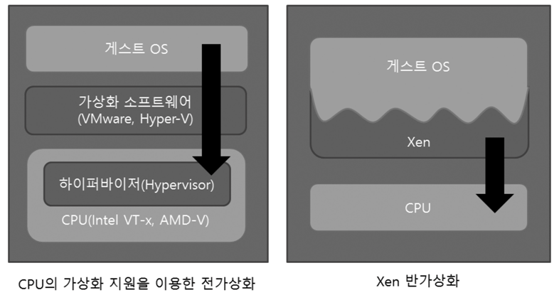
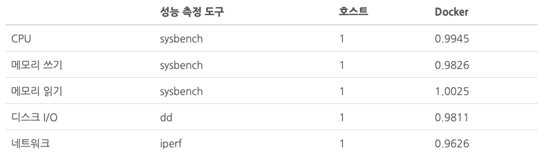
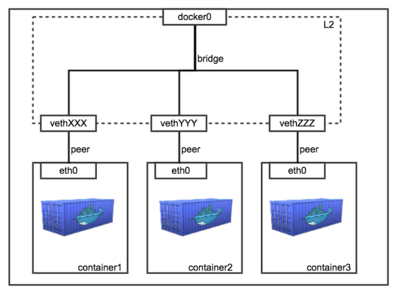

# Docker 사용 가이드


### 개요

- 2013년 3월 Docker,. inc 에서 출시. 오픈소스 컨테이너 프로젝트

- 리눅스 애플리케이션을 묶어서 리눅스 커널에서 제공하는 컨테이너 기술로(LXC) 실행

-  Official 이미지와 사용자 이미지도 공유하여 사용 가능(Docker hub)


### 가상화 VS 컨테이너




- 가상화

  - 물리 장비 기반에서 + Host OS + Hypervisor  + CPU/MEM 할당 + Guest OS 설치
  - 위에 다시 Library 설치 하고, Application 사용.
  - 전체 하드웨어를 가상화 함. Hypervisor에 의해 Guest OS와 Host OS 를 중재함. 
  - CPU/MEM 등의 자원 할당을 하였으나, 가상 하드웨어를 만드는 과정과 직접 CPU에 명령하는 형태로 인해 성능이 좋지 못한 단점을 가짐. (전가상화 : Full Virtualization : VirtualBox, VMWare workstation)
  - Guest OS의 커널이 수정 안됨.

- 컨테이너 (반가상화 : Paravirtualization : VMWare ESX Server, Hyper-V, Xen, Solaris xVM Server, ...)

  - Host OS의 커널에서 자원 할당하는 LXC기술(리소스-cpu/mem/disk/network의 커널 레벨 격리)
  - 물리 장비 기반 + OS + Docker Engine 
  - 위에 필요한 Library 설치 하고, Application 사용.
  - Guest OS 가 설치 되지 않고, 프로그램과 라이브러리만 격리.
  - Guest OS 커널 수정 됨.

- Docker 성능 자료

  


### Docker 설치 (for Windows 10 Pro)

- Windows 10 Pro 부터 Hyper-V를 사용한 반가상화 방식으로 실행 가능.

  (이하 Windows 버전에서는 Virtual Box를 사용하는 전가상화 방식)

- GitLab Utility에 기록된 Docker for windows Installer.exe 참고

  > 주의사항) Windows 10 최신 업데이트 수행 후 설치 필요. (1803)
  >
  > 최신 업데이트가 아닌 경우 Docker가 정상 수행되지 않음.

- tls 옵션 설정 


### Docker 기본 용어

- Image : Immutable (붕어빵 주조틀)

- Container : Mutable (붕어빵)

- Hub : 공식 저장소 (붕어빵, 잉어빵, 빙어빵, 잉어같은 붕어빵 등... 주조틀 보관소)

-  Layer : Iamge의 바뀐 부분을 관리하는 방식

  

### Docker Command

- pull : docker hub로 부터 이미지를 내려받기

  - <이미지명>:<테그명>

- run : 다운받은 이미지로부터 컨테이너 생성하기

  - --name : 난수화된 컨테이너 ID에 명시한 이름 부여
  - -d or --detach : 데몬모드로 실행. 누락 시, 컨테이너의 상태가 exited로 전환됨.

- exec : 만들어진 컨테이너에 접속하기

  - -i : interactive
  - -t : tty 모드
  - (마지막) : 실행 명령어

- commit : 컨테이너를 이미지로 커밋하는 작업

- tag : 새로 등록할 이미지에 tag를 부여

  - docker login 
  - <도커허브 유저ID>/<리파지토리명>:<테그명>

- push : 새로 변경된 로컬 이미지를 허브에 등록하는 작업

  - docker login 
  - <도커허브 유저ID>/<리파지토리명>:<테그명>

- images : 현재 로컬에 내려받아진 이미지 목록 조회

- ps : 현재 로컬에서 사용하는 컨테이너 목록 조회

- cp : 호스트에서 컨테이너로 파일 전송

- start/stop : 구동 중인 컨테이너 구동/멈추기

- rm : 컨테이너 삭제하기

- rmi : 이미지 삭제하기

- logs : 컨테이너 로그 확인

- build : 이미지 만들기

  - -t : 테그명
  - -f <Dockerfile> : 이미지를 만들기 위한 쉘스크립트 파일

  

### Docker file

- FROM : 모든 도커파일을 FROM으로 시작함. FROM 뒤에는 배경이 될 이미지가 명시.

- ARG : docker build 명령시 외부전달로 받을 수 있는 파라미터

  - --build-arg <ARG명>=<사용할 값> 

- ENV : 생성된 Docker Image 내에서 사용할 환경 변수.

- RUN : 이미지 내에서 실행될 명령

- COPY <src> <dest> : <src> 새 파일을 복사하여 경로의 <dest>에 있는 컨테이너의 파일 시스템에 추가

- ADD <src> <dest> : <src> 새 파일을 복사하여 경로의 <dest>의 컨테이너 파일 시스템에 추가

  >  COPY, ADD 유사하나, 명확한 COPY를 주로 사용. ADD는 tar 추출 및 원격 URL등 추가 기능 지원

- EXPOSE : 컨테이너에서 호스트로 개발될 포트를 명시

- VOLUME : 컨테이너에서 호스트와 공유할 볼륨을 명시

- CMD : docker run에 매핑되는 명령어


###### Dockerfile Sample #1

```dockerfile
FROM openjdk:8-jdk-alpine
ADD retrieve-usagedata-svc.jar app.jar
ENTRYPOINT ["java","-Djava.security.egd=file:/dev/./urandom","-jar","/app.jar"]
```

> - openjdk 이미지를 기반으로 사용자 Application을 복사하여 사용.
>
>   - official 이미지 사용을 권고
>
>   - 잦은 버전업에 따른 docker image를 누적을 최소화 하기 위해 생성 이미지는 최척화 하는 것도 고려.
>
>     
>
> - java.security.egd=file:/dev/./urandom  또는 random : 난수 발생에 옵션으로 제공하는 부분으로 지정하지 않을 경우 암호화 과정에서 필요한 난수가 동일한 패턴으로 되거나 발행되지 않을 수 있음. urandom 과 random에 차이가 있으나, 일반적으로 분포도가 작고 대량의 랜덤 생성 시에는 urandom 을 사용.


###### Dockerfile Sample #2

```dockerfile
FROM openjdk:8-jdk-alpine
ADD retrieve-usagedata-db-svc.jar app.jar
ENV POSTGRES_ENV_IP 127.0.0.1
ENV POSTGRES_ENV_PORT 5432
ENV POSTGRES_ENV_DB garage
ENTRYPOINT ["java","-Djava.security.egd=file:/dev/./urandom","-jar","/app.jar"]
```

>- ENV 외부 실행 환경 변수 입력
>
>  - 실제 소스(application.properties)에서는 아래와 같이 사용됨.
>
>    ```properties
>    spring.datasource.url=jdbc:postgresql://${POSTGRES_ENV_IP}:${POSTGRES_ENV_PORT}/${POSTGRES_ENV_DB}
>    spring.datasource.username=kos_user
>    spring.datasource.password=new1234!
>    spring.jpa.generate-ddl=true
>    ```
>  - 지정된 변수 외에 대체 실행 할 경우 -e "POSTGRES_ENV_IP=127.0.0.1" 같은 형태로도 사용 가능.


###### Dockerfile Sample #3

```dockerfile
FROM ubuntu:14.04
RUN apt-get update && apt-get install -y \
    curl \
    nginx \
&& rm -rf /var/lib/apt/lists/*
```

>- RUN 명령마다 레이어 생성되기 때문에 update, install 구문을 개별로 작성하면, 2번째 구문부터 최신 install 이 되지 않음. 위와 같이 병령적으로 처리 하게 하는 것을 권장함.


###### Dockerfile Sample #4

```dockerfile
FROM ubuntu
CMD echo "This is a test."
```

>- CMD 는 docker run 실행 시 명령어를 주지 않았을 때 사용할 default 명령 설정.
>  - docker run -it <image-name> : 자동으로 echo "This is a test." 실행
>  - docker run -it <image-name>  echo "hello" : hello 로 대체 수행


###### Dockerfile Sample #5

```dockerfile
FROM ubuntu
ENTRYPOINT ["/bin/echo", "Hello"]
CMD ["world"]
```

>- ENTRYPOINT는 docker run 실행 시 수행되는 명령어
>- CMD 는 별도 지정하지 않으면, default 명령 수행.


###### Dockerfile Sample #6

```dockerfile
FROM ubuntu
ENTRYPOINT ["echo", "$HOME"]
```

>- "$HOME" 그대로 출력


###### Dockerfile Sample #7

```dockerfile
FROM ubuntu
ENTRYPOINT echo $HOME
```

>- "/root" 로 출력


### With Spring Boot

#### 프로젝트 구조

```
.
├── Jenkinsfile
├── mvnw
├── mvnw.cmd
├── pipeline.properties
├── pom.xml
├── src
│   ├── main
│       ├── docker
│       │   └── Dockerfile
│       ├── java
│       │   └── com
│       │       └── garage
│       │           └── usagedata
│       │               ├── RetrieveUsagedataSvcApplication.java
│       │               ├── bean
│       │               │   └── UsageData.java
│       │               ├── config
│       │               │   └── RedisRepositoryConfig.java
│       │               ├── controller
│       │               │   └── UsageDataController.java
│       │               ├── remote
│       │               │   └── bean
│       │               │       ├── Data_DataSvcDrctlyUseQntList.java
│       │               │       ├── Data_DataTotDtlRetvProdNm.java
│       │               │       ├── Data_DrctlyUseQntFreeRetv.java
│       │               │       ├── Data_DrctlyUseQntMyOllehListRetv.java
│       │               │       ├── Data_DrctlyUseQntUsageRetv.java
│       │               │       └── Data_UsePtrn3monsRetv.java
│       │               └── repository
│       │                   └── UsageDataRedisRepository.java
│       └── resources
│           └── application.properties
└── usagedata.iml
```

>- Spring Boot  기반으로 Java 프로젝트를 권고하며, Maven 사용을 기반으로 가이드 되어 있음.
>- Dockerfile 의 위치는 "/src/main/Dockerfile" 을 기본 위치로 지정함.
>- Jenkinsfile 의 위치는 "/" 을 기본 위치로 지정함.


#### Maven 연계

```xml
<?xml version="1.0" encoding="UTF-8"?>
<project xmlns="http://maven.apache.org/POM/4.0.0" xmlns:xsi="http://www.w3.org/2001/XMLSchema-instance"
	xsi:schemaLocation="http://maven.apache.org/POM/4.0.0 http://maven.apache.org/xsd/maven-4.0.0.xsd">
	<modelVersion>4.0.0</modelVersion>
	<parent>
		<groupId>org.springframework.boot</groupId>
		<artifactId>spring-boot-starter-parent</artifactId>
		<version>2.1.1.RELEASE</version>
		<relativePath/> <!-- lookup parent from repository -->
	</parent>
	<groupId>com.garage</groupId>
	<artifactId>usagedata</artifactId>
	<version>v1.0</version>
	<name>retrieve-usagedata-svc</name>
	<description>Retrieve Usage Data</description>

	<properties>
		<java.version>1.8</java.version>
		<docker.image.prefix>kos-mvp</docker.image.prefix>
	</properties>

	<dependencies>
		<dependency>
			<groupId>org.springframework.boot</groupId>
			<artifactId>spring-boot-starter-data-redis</artifactId>
		</dependency>
		<dependency>
			<groupId>org.springframework.boot</groupId>
			<artifactId>spring-boot-starter-web</artifactId>
		</dependency>

		<dependency>
			<groupId>org.springframework.boot</groupId>
			<artifactId>spring-boot-starter-test</artifactId>
			<scope>test</scope>
		</dependency>
		
		<dependency>
			<groupId>org.projectlombok</groupId>
			<artifactId>lombok</artifactId>
			<scope>provided</scope>
		</dependency>
		
		<dependency>
		    <groupId>it.ozimov</groupId>
		    <artifactId>embedded-redis</artifactId>
		    <version>0.7.2</version>
		</dependency>
		
		<dependency>
			<groupId>io.springfox</groupId>
			<artifactId>springfox-swagger2</artifactId>
			<version>2.9.2</version>
		</dependency>
				
		<dependency>
			<groupId>io.springfox</groupId>
			<artifactId>springfox-swagger-ui</artifactId>
			<version>2.9.2</version>
		</dependency>

		<dependency>
			<groupId>redis.clients</groupId>
			<artifactId>jedis</artifactId>
			<version>3.0.0</version>
			<type>jar</type>
			<scope>compile</scope>
		</dependency>
		
	</dependencies>

	<build>
		<finalName>retrieve-usagedata-svc</finalName>
		<plugins>
			<plugin>
				<groupId>org.springframework.boot</groupId>
				<artifactId>spring-boot-maven-plugin</artifactId>
			</plugin>
			
			<plugin>
			    <groupId>com.spotify</groupId>
			    <artifactId>docker-maven-plugin</artifactId>
			    <configuration>
			        <imageName>${docker.image.prefix}/${project.artifactId}:${project.version}</imageName>
			        <dockerDirectory>src/main/docker</dockerDirectory>
			        <resources>
			            <resource>
			                <targetPath>/</targetPath>
			                <directory>${project.build.directory}</directory>
			                <include>${project.build.finalName}.jar</include>
			            </resource>
			        </resources>
			        <googleContainerRegistryEnabled>false</googleContainerRegistryEnabled>
			    </configuration>
			</plugin>
		</plugins>
	</build>

</project>

```

> - pom.xml  <build> 테그에 spotify plugin 을 추가하여 maven docker 관련 기능을 사용함.
>
> - 기본적인 <imageName> 방식은 변경 가능하나, 현재는 지정한 group projection 명칭(namespace)에 <project.artifactId>를 기준으로 생성하게 되어 있음.
>
> - 외부 폐쇄네트워크 환경을 고려하여 google container OAUTH관련 부분에 대한 인증을 차단하기 위한 옵션을 추가로 지정함.
>
> - 개발과정에서 생성하는 이미지는 특별한 Tag를 부여하지 않고, <project.version> 에 명칭한 내용으로 기술함.
>
>   (CI/CD 프로세스상에 이미지 생성시에는 자동생성되는 방식으로 예정됨.)


#### Build

###### STS 또는Eclipse 일 경우 (SKIP 테스트 할 경우)

- Run as --> Maven Build --> check skip Test --> goal 항목이 이하 내용 기술

  > clean package docker:build


###### Console 일 경우

- 프로젝트 위치에서 (SKIP 테스트할 경우)

  > mvn clean package -DskipTests docker:build


`주의사항` 

- docker build 이후 실행중인 상태에서 재빌드 시에는 docker image에 이전 이미지는   으로 변경됨.

- docker 이미지 삭제 후 실행 필요.

  (TAG를 명시하지 않아, 재 생성이 동일한 이름과  TAG로 만들어 지기 떄문임.)

  | REPOSITORY        | TAG    | IMAGE ID     | CREATED        | SIZE  |
  | ----------------- | ------ | ------------ | -------------- | ----- |
  | kos-mvp/usagedata | latest | a79276e0dec3 | 6 seconds ago  | 136MB |
  | <none>            | <none> | 8dcd2ed42baa | 20 minutes ago | 136MB |

  


#### 실행

###### Run sample #1

```shell
docker run -p 8080:8080 -it kos-mvp/usagedata
```

> - 일반적인 방법.
> - -p <호스트 포트> : <컨테이너 포트>


###### Run sample #2

```shell
docker run -p 8080:8080 -e "SPRING_PROFILES_ACTIVE=local" -it kos-mvp/usagedata
```

> - 시스템 변수를 -e "변수=값" 형태로 전달.


###### Run Sample #3

```shell
docker run -p 8080:8080 -e "spring.profiles.active=local" -it kos-mvp/usagedata
```

> - 내부 어플리케이션 설정파일인 [application.properties]를 외부에서 기본적으로 변경가능하나, Sample #2와 같이 대문자 와 '_(underscore)' 형태로 기술하는 것이 Reference이며, Sample #3과 같이 properties 명에 직접 변경도 가능함.


###### Run sample #4

```shell
docker run -p 8080:8080 -e "POSTGRES_ENV_IP=169.56.74.8" -e "POSTGRES_ENV_PORT=5432" -e "POSTGRES_ENV_DB=garage" -it kos-mvp/usagedata-db
```

> - -e "변수=값" 형태로 외부 변수를 전달 가능. **`-it 키워드 보다 앞에 위치함에 주의`**
> - -i interactive 모드
> - -t tty 모드


### Docker Network

###### network



> - docker host를 설치한 후 **"docker0"** 라는 virtual interface가 생성 됨. (windows는 다름.)
> - docker0 interface 특징은 기본적으로 **"172.17.42.1"** 로 설정되며 16bit netmask(255.255.0.0)로 설정.
> - 일반적인 interface가 아닌, virtual ethernet bridge로 동작.
> - 컨테이너 내부의 IP는 모두 **"172.17.0.1"** 부터 할당되고, Gateway로 **"172.17.42.1"** 로 지정 됨.


###### network 지정방식

- bridge
  - docker의 기본 network 방식
  - 새로 생성되는 컨테이너는 docker0 bridge에 하나씩 binding 되는 구조
- host
  - 호스트의 네트워크를 사용
  - 호스트 IP가 그대로 표시
  - docker0에 binding 되지 않음
  - docker inspect 키워드로 ip가 보여지지 않음. 
- container
  - 다른 컨테이너의 network 환경을 공유 함.
- none
  - 인터페이스가 없는 상태.
  - loopback 인터페이스만 있음.
  - 직접 interface 만드는 특별한 케이스 등에 사용.


###### network 외부통신

- port 옵션

  ```
  docker run -d -p 8080:80 --name nginx nginx
  ```

  > - -p <host port> <container pot> 형태로 호스트로 입력되는 요청이 컨테이너의 포트로 forwarding 됨.
  > - 호스트에서 netstat 확인 시 8080 수신 포트가 생성됨.
  > - 8080 포트 수신은 docker-proxy에 의해 하나의 Process로써 동작하여 forwarding 됨. 초기 docker에서 수행하던 패턴으로 userland 에서 동작되기 때문에 성능 저하 및 처리 과정에 많은 메모리 사용등의 이슈로 인해 현재는 iptable 방식으로 변경됨. (필요시 docker-proxy 로 지정 선택 가능. from docker 1.7 version)
  >   - `DOCKER_OPTS='--iptables=false'` : docker-proxy 사용 옵션
  > - docker-proxy 방식에서 iptables 방식으로 변경되면서, 성능적 이점을 획득하였으나, 호스트 to 컨테이너 port 옵션이 많이 사용될 수록 iptables에 복잡하게 생성되는 형태가 됨.


###### network 내부통신

- link 옵션

  - 컨테이너를 복수로 구성(예, WEB, WAS, DB)하였을 경우, 각 컨테이너 간의 통신을 하기 위한 방식이 필요하나, 컨테이너 동작시에 네트워크 IP 구성은 지정하지 않고 자동으로 부여되는 형태임.
  - 따라서, 컨테이너별 동작이 유동적이면서 내부통신이 가능하기 위한 방식에 대한 지정이 필요함.

  ```
  docker run -d --name tomcat --link mysql
  ```

  > - --link 옵션으로 tomcat 이라는 현재 기동하는 컨테이너는 이미 기동한 mysql 이라는 컨테이너와 이어지도록 함.
  > - mysql 이라는 컨테이너는 기존에 동작할 때 --name mysql 명령에 의해 명시적으로 동작되었어야 함.
  > - link는 tomcat 이라는 컨테이너안의 host에 mysql 의 IP를 기술하여 동작케 함.
  > - mysql 이 재기동되어 IP가 변경이 되는 경우에도 자동으로 변경됨.
  >   - 컨테이너 host 파일은 호스트에 /var/lib/docker/containers/<고유번호>/hosts 파일로 설정되어 호스트에서 변경사항을 docker daemon에 의해 기록 또는 변경 하게 됨.


### Docker-compose

###### 필요배경

- 다양한 network 옵션을 통해 컨테이너를 활성화 하고 내부 통신이 가능하나, 동작의 순서를 지켜야 하는 제약과 컨테이너의 수가 많은 경우 커맨드 입력도 많아지는 동작의 불편함이 발생.
- 전반적인 실행 스크립트로써, 여러 컨테이너를 동작을 관리하는 방식의 제어가 필요.
- 참고 : https://docs.docker.com/compose/overview/


###### Sample File

```yaml
version: '3'
services:
  usagedata:
    #    build: ./retrieve-usagedata-svc
    image: kos-mvp/usagedata
    environment:
      target.service.name: usagedata-db:8080
      spring.redis.host: redis
    ports:
     - "8080:8080"
    links:
     - usagedata-db
     - redis

  usagedata-db:
    #    build: ./retrieve-usagedata-db-svc
    image: kos-mvp/usagedata-db
    environment:
      target.service.name: manage-cache:8080
      POSTGRES_ENV_IP: postgres
      POSTGRES_ENV_PORT: 5432
      POSTGRES_ENV_DB: engage
    links:
     - manage-cache
     - postgres 

  manage-cache:
    #    build: ./redis-cache-manager
    image: kos-mvp/manage-cache
    environment: 
      spring.redis.host: redis
    links:
     - redis

  redis:
    image: "redis:alpine"

  postgres:
    image: postgres
    environment:
     - POSTGRES_DB=engage
     - POSTGRES_USER=kos_user
     - POSTGRES_PASSWORD=new1234!
     - POSTGRES_INITDB_ARGS=--encoding=UTF-8
    volumes:
      - data:/var/lib/postgresql/data
      # - ./data/data.sql:/docker-entrypoint-initdb.d/init.sql
volumes:
  data:
    external: true
```

> - version : docker 버전과 호환성을 참고하여 기술
> - services : 구동해야 할 컨테이너 단위
>   - build : image가 없거나 변경해야 하는 경우 사용하여, 동작 가능 (비 권고)
>   - image : Dockerfile 로 생성하거나 repository에 있는 이미지명 기술
>   - environment : 실행에 필요한 외부 환경변수
>   - links : network option (link)
>   - volumes : 휘발성으로 동작하는 컨테이너의 자료보관을 호스트 볼륨 mount 포인트로 지정하기 위한 volume 정보 기술 (stateful을 지원하기 위한 용도)


###### 명령어

```
docker-compose -f <docker-compose file name> up -d
```

> docker compose 파일에 기술한 내용을 실행.


```
docker-compose down --remove-orphans
```

> docker compose 로 동작중인 컨테이너 종료.
>
> --remove-orphans 옵션을 지정하면 link 또는 depend on 되어 있는 reference 컨테이너도 모두 종료 함.


```
docker-compose scale usagedata=2
```

> 특정 컨테이너에 대해서 복수 동작 (default 1 -> 2)

###### 

###### yaml 파일 작성

- image

  ```
  image: redis
  image: kos-mvp/usagedata
  image: kos-mvp/manage-cache
  image: <image id>
  image: kos-mvp.kt.com:5000/manage-cache:v1.0
  ```

  > - 서비스 컨테이너를 생성할 이미지 명. repository에 존재하는 명칭이어야 함. (없는 경우 docker hub에서 pull 을 시도하나, 폐쇄 네트워크 환경일 경우 오류 발생됨.)
  > - TAG 가 latest가 아닌 경우 명시적인 TAG 사용에 유의.

- links

  ```
  links:
    - manage-cache
    - postgres
  ```

  > - docker run 명령어에서 사용하는 -link와 동일
  > - yaml 구성파일 안에 명시된 service 수준에서 사용 가능
  > - depends_on 을 명령어와 유사하지만, 순서를 보장하는 추가 기능이 있음.

- environment

  ```
  environment:
        target.service.name: usagedata-db:8080
        spring.redis.host: redis
  ```

  > - docker run 명령어에서 -e 로 사용하는 옵션과 동일

- command

  ```
  command: echo "hello world"
  ```

  > - docker run 명령어에서 마지막에 붙은 keyword와 같은 역활.

- ports

  ```
  ports:
       - "8080:8080"
  ```

  > - docker run 명령어에서 -p로 사용하는 옵션과 동일

